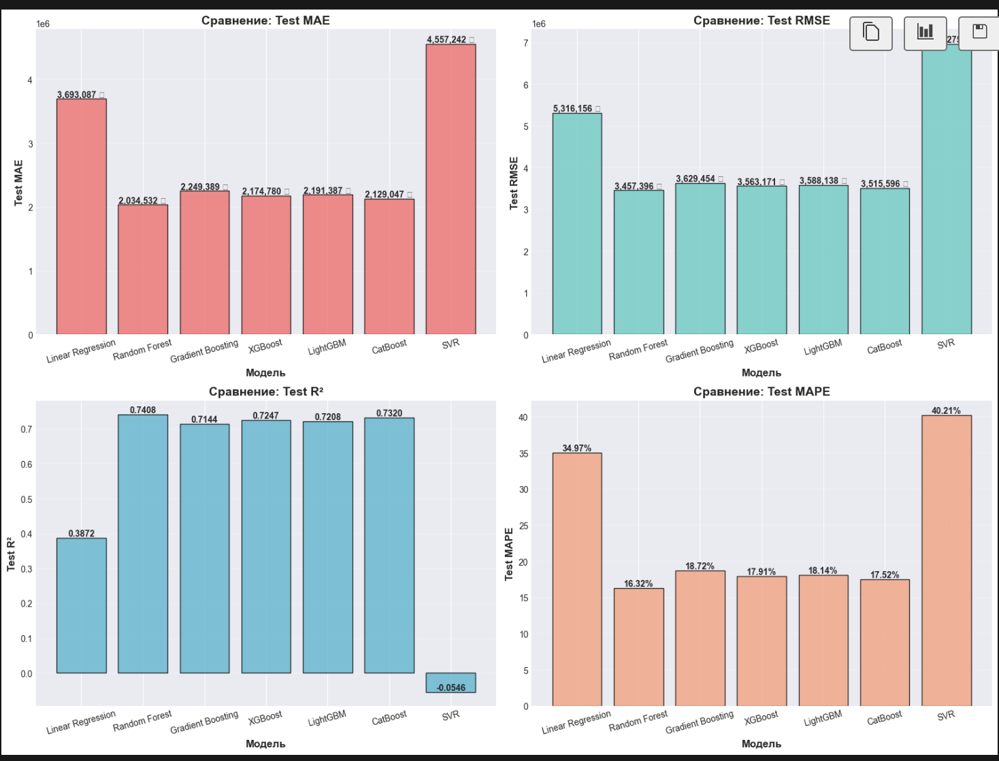

# Предсказание цен на квартиры в Москве

> **Экзаменационный проект по курсу "Введение в машинное обучение"**  
> Авторы: Деружинский Дмитрий, Токарев Алексей | 2025

## Цель работы

Разработать модель машинного обучения для предсказания стоимости квартир в Москве на основе их характеристик (площадь, количество комнат, этаж, расстояние до метро и др.). Задача решается методами регрессии с использованием различных семейств алгоритмов: от классических (линейная регрессия) до ансамблевых методов (градиентный бустинг).

## Описание проекта

Проект направлен на решение практической задачи оценки недвижимости с использованием открытых данных. Особенности реализации:

- **Объединение множественных источников данных**: 4 датасета с Kaggle за разные годы (2018-2024)
- **Унификация схемы данных**: приведение разнородных данных к единому формату
- **Сравнительный анализ моделей**: 7 различных алгоритмов машинного обучения
- **Интерактивное приложение**: Streamlit для демонстрации работы модели
- **Полная воспроизводимость**: автоматизированные скрипты для всех этапов пайплайна

## Выполненные дополнительные требования

| Критерий | Статус | Детали |
|----------|--------|--------|
| **Множественные датасеты** | Выполнено | 4 датасета с Kaggle, ~44,000 записей |
| **Streamlit приложение** | Выполнено | Интерактивный интерфейс, готов к деплою на Hugging Face |
| **Сравнение семейств моделей** | Выполнено | Классические (Linear Reg, SVR), ансамбли (RF, GB), градиентный бустинг (XGBoost, LightGBM, CatBoost) |


## Структура проекта

```
DeruzhinksiiTokarevProjectML/
├── data/
│   ├── raw/                    # Исходные датасеты
│   └── processed/              # Обработанные данные
├── notebooks/                  # Jupyter ноутбуки для анализа и обучения
├── src/
│   ├── data/                   # Модули загрузки и обработки данных
│   │   ├── loader.py           # Класс MoscowHousingLoader (загрузка raw данных)
│   │   ├── dataset.py          # Класс MoscowHousingDataset (для обучения)
│   │   ├── schemas.py          # Схемы и маппинги колонок
│   │   ├── prepare_dataset.py  # Скрипт подготовки датасета
│   │   └── preprocessor.py     # Класс DataPreprocessor (масштабирование признаков) 
│   └── streamlit/              # Streamlit приложение
├── download_data.sh            # Скрипт загрузки данных с Kaggle
├── setup_venv.sh               # Настройка виртуального окружения
├── prepare_dataset.sh          # Запуск подготовки данных
└── requirements.txt            # Зависимости Python
```

## Быстрый старт

### 1. Настройка окружения

Создайте виртуальное окружение и установите зависимости:
```bash
./setup_venv.sh
```

### 2. Настройка Kaggle API

Для загрузки данных необходим Kaggle API токен:

1. Зарегистрируйтесь на [Kaggle](https://www.kaggle.com/)
2. Перейдите в настройки: `Account` → `API` → `Create New API Token`
3. Скачается файл `kaggle.json`
4. Поместите его в домашнюю директорию:
   - **macOS/Linux**: `~/.kaggle/kaggle.json` (выполните `chmod 600 ~/.kaggle/kaggle.json`)
   - **Windows**: `C:\Users\<username>\.kaggle\kaggle.json`

### 3. Загрузка данных

Запустите скрипт для скачивания всех необходимых датасетов:
```bash
./download_data.sh
```

### 4. Подготовка данных

Запустите скрипт объединения данных:
```bash
./prepare_dataset.sh
```

Результат будет сохранен в `data/processed/moscow_housing_merged.csv`.

## Данные

### Используемые датасеты

Проект использует следующие датасеты с Kaggle:

1. **Prices of Moscow apartments (2024)**
   - Ссылка: [Kaggle](https://www.kaggle.com/datasets/ivan314sh/prices-of-moscow-apartments)
   - Файл: `prices_moscow_2024.csv`
   - Записей: ~7,000

2. **Moscow Apartment Listings (2020)**
   - Ссылка: [Kaggle](https://www.kaggle.com/datasets/alexeyleshchenko/moscow-apartment-listings)
   - Файл: `moscow_apartment_listings_2020.csv`
   - Записей: ~12,000

3. **Price of flats in Moscow (2018)**
   - Ссылка: [Kaggle](https://www.kaggle.com/datasets/hugoncosta/price-of-flats-in-moscow)
   - Файл: `price_flats_moscow_2018.csv`
   - Записей: ~2,000

4. **Moscow Housing Price Dataset**
   - Ссылка: [Kaggle](https://www.kaggle.com/datasets/egorkainov/moscow-housing-price-dataset)
   - Файл: `moscow_housing_price.csv`
   - Записей: ~23,000

**Итого**: ~44,000 записей после объединения

### Унифицированная схема данных

Все датасеты преобразуются к единой схеме:

| Колонка | Тип | Описание | Пропуски |
|---------|-----|----------|----------|
| `price` | float | Цена квартиры (₽) | 22 (0.05%) |
| `total_area` | float | Общая площадь (м²) | 23 (0.05%) |
| `rooms` | int | Количество комнат | 2,040 (4.65%) |
| `floor` | int | Этаж квартиры | 23 (0.05%) |
| `total_floors` | int | Этажей в здании | 2,063 (4.70%) |
| `subway_dist` | float | Расстояние до метро (м) | 137 (0.31%) |
| `year` | int | Год датасета | 0 (0%) |

**Примечания:**
- Для `subway_dist`: если в исходных данных указано время, используется скорость пешехода 5 км/ч (83.33 м/мин)
- `year`: год публикации датасета (2018, 2020, 2023, 2024)

#### Качество данных

После очистки и объединения:
- Общее количество записей: **43,880**
- Средний процент заполненности: **~96%**
- Колонки с минимальными пропусками (<0.5%): `price`, `total_area`, `floor`, `subway_dist`
- Колонки с умеренными пропусками (~5%): `rooms`, `total_floors`

## 🤖 Используемые алгоритмы

Проект включает сравнительный анализ следующих семейств моделей:

### 1. Классические методы
- **Linear Regression**: Базовая линейная модель, простая и интерпретируемая
- **Support Vector Regression (SVR)**: Метод опорных векторов с RBF ядром

### 2. Ансамблевые методы на основе деревьев
- **Random Forest**: Случайный лес из 100 деревьев решений
- **Gradient Boosting (sklearn)**: Классический градиентный бустинг

### 3. Градиентный бустинг (специализированные библиотеки)
- **XGBoost**: Оптимизированная реализация градиентного бустинга
- **LightGBM**: Эффективный градиентный бустинг от Microsoft
- **CatBoost**: Градиентный бустинг от Yandex с автоматической обработкой категориальных признаков

### Обоснование выбора

1. **Линейная регрессия**: Базовая модель для установления нижней планки качества (baseline)
2. **Ансамбли и бустинг**: Ожидается высокая точность на табличных данных
3. **Специализированный бустинг**: CatBoost, XGBoost, LightGBM показывают state-of-the-art результаты на задачах регрессии

## Измерение качества моделей

### Метрики

Для оценки моделей используются следующие метрики:

1. **MAE (Mean Absolute Error)** - средняя абсолютная ошибка в рублях
   - Легко интерпретируется: средняя ошибка предсказания
   - Не чувствительна к выбросам

2. **RMSE (Root Mean Squared Error)** - корень из средней квадратичной ошибки
   - Штрафует большие ошибки сильнее, чем MAE
   - Показывает разброс предсказаний

3. **R² (Coefficient of Determination)** - коэффициент детерминации
   - Доля объясненной дисперсии (0-1, чем ближе к 1, тем лучше)
   - Показывает, насколько модель лучше простого среднего

4. **MAPE (Mean Absolute Percentage Error)** - средняя абсолютная процентная ошибка
   - Относительная метрика, показывает ошибку в процентах
   - Удобна для сравнения с другими задачами

### Методология оценки

- **Train/Val/Test split**: 70% / 15% / 15%
- **Preprocessing**: StandardScaler для нормализации признаков
- **Early stopping**: Для предотвращения переобучения (CatBoost, XGBoost, LightGBM)
- **Сохранение лучшего чекпоинта**: По метрике R² на валидационной выборке

## 🎯 Итоговые результаты

### Сравнение моделей




## Демонстрация работы

### Streamlit приложение

Интерактивное веб-приложение для предсказания цен:

```bash
source venv/bin/activate
streamlit run src/streamlit/app.py
```

Функционал:
- Ввод параметров квартиры через веб-интерфейс
- Получение предсказания цены от лучшей модели
- Сравнение с рыночной статистикой
- Визуализация метрик модели

См. подробности в [`src/streamlit/README.md`](src/streamlit/README.md)

### Jupyter ноутбук

Полный пайплайн обучения и анализа:

```bash
source venv/bin/activate
jupyter notebook notebooks/training_pipeline.ipynb
```

Содержание:
- Загрузка и анализ данных (EDA)
- Обработка выбросов
- Обучение 7 моделей
- Сравнительный анализ результатов
- Сохранение лучшей модели

См. подробности в [`notebooks/README.md`](notebooks/README.md)

## Разработка

### Добавление нового датасета

1. Добавьте маппинг колонок в `src/data/schemas.py`:
   ```python
   DATASET_MAPPINGS = {
       "new_dataset": {
           "price_col": "price",
           "area_col": "total_area",
           # ...
       }
   }
   ```

2. Укажите имя файла в `DATASET_FILES`
3. Добавьте год в `DATASET_YEARS`
4. Добавьте загрузку в `download_data.sh` (если с Kaggle)
5. Обновите `src/data/loader.py` при необходимости

## Лицензия

MIT License - см. файл [LICENSE](LICENSE)

## Авторы

- Деружинский Дмитрий
- Токарев Алексей
